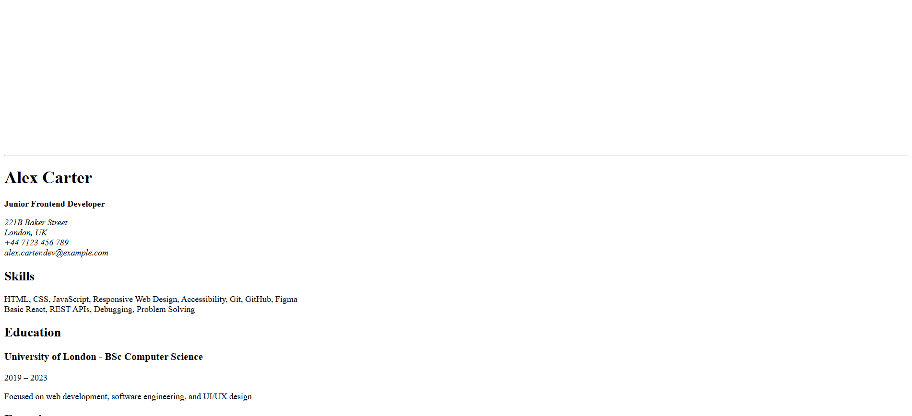
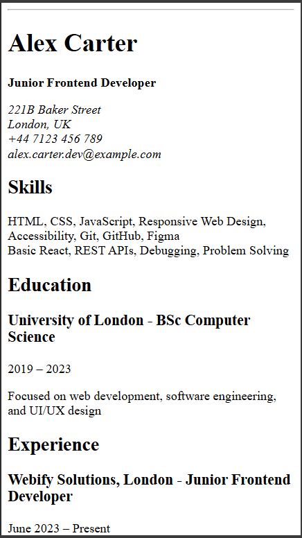

# Single-Page CV

A single-page CV built using semantic HTML as part of the roadmap.sh frontend projects.

---

## Description

This project is a simple, structured CV webpage created using only HTML. The goal was to organize information such as skills, education, and experience in a clear and semantic way.

The project focuses on proper HTML structure without any styling, preparing the layout for future CSS improvements.

**Note:** The data used in this project is fictional and created for demonstration purposes only.

---

## Preview

### Desktop View



### Mobile View



---

## Features

* Single-page layout
* Semantic HTML structure
* Sections for skills, education, and experience
* SEO meta tags
* Open Graph tags
* Favicon support

---

## Technologies

* HTML5

---

## How to Run

Open `index.html` in any web browser.

---

## Project Structure

```
project/
│── index.html
│── favicon.ico
│── desktop.png
│── mobile.png
└── README.md
```

---

## What I Learned

* How to structure a webpage using semantic HTML
* How to organize content clearly
* Basics of SEO meta tags
* How to prepare HTML for future styling

---

## Future Improvements

* Add CSS styling
* Make layout responsive
* Improve typography and spacing

---

## Project URL

https://roadmap.sh/projects/single-page-cv
